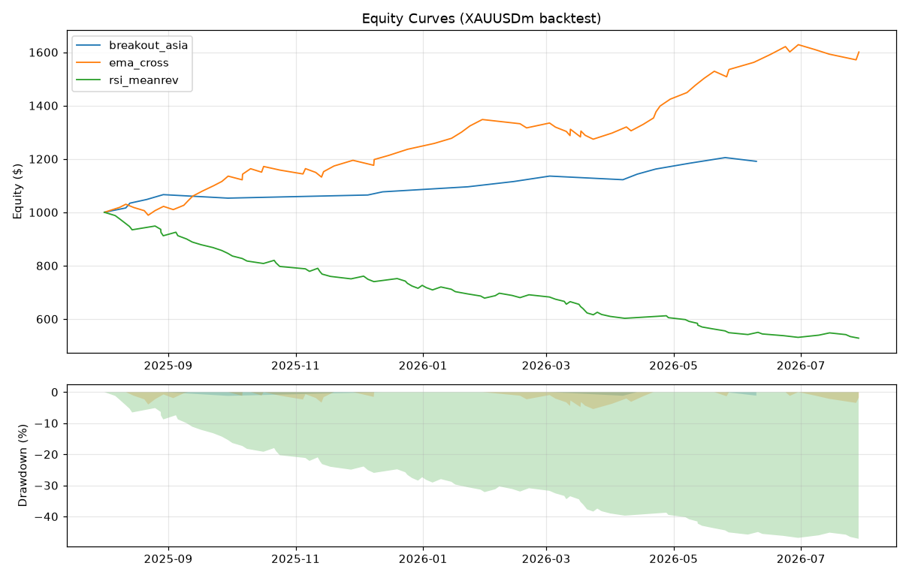

# Backtest Report — XAUUSDm

## Metrics

| hypo | trades | winrate | PF | max DD | expectancy $ | total ret | final eq |
|---|---|---|---|---|---|---|---|
| breakout_asia | 16 | 81.2% | 5.699 | 1.2% | 11.94 | 19.1% | $1191.04 |
| ema_cross | 71 | 64.8% | 2.473 | 5.5% | 8.46 | 60.1% | $1600.65 |
| rsi_meanrev | 88 | 19.3% | 0.273 | 46.5% | -5.36 | -47.2% | $528.27 |

## Monte Carlo (1000 shuffle)

| hypo | final p05 | median | p95 | prob loss | prob negative | ruin prob |
|---|---|---|---|---|---|---|
| breakout_asia | $1191.05 | $1191.05 | $1191.05 | 0.0% | 0.0% | 0.0% |
| ema_cross | $1600.66 | $1600.66 | $1600.66 | 0.0% | 0.0% | 0.0% |
| rsi_meanrev | $528.25 | $528.25 | $528.25 | 100.0% | 0.0% | 1.2% |

## Correlation (daily PnL, 131 วัน overlap)

| | breakout_asia | ema_cross | rsi_meanrev |
|---|---|---|---|
| **breakout_asia** | 1.00 | 0.01 | -0.12 |
| **ema_cross** | 0.01 | 1.00 | 0.04 |
| **rsi_meanrev** | -0.12 | 0.04 | 1.00 |

> corr > 0.5 = กลยุทธ์ซ้ำซ้อนกัน (เทรดพร้อมกันไม่ช่วยกระจายความเสี่ยง)

